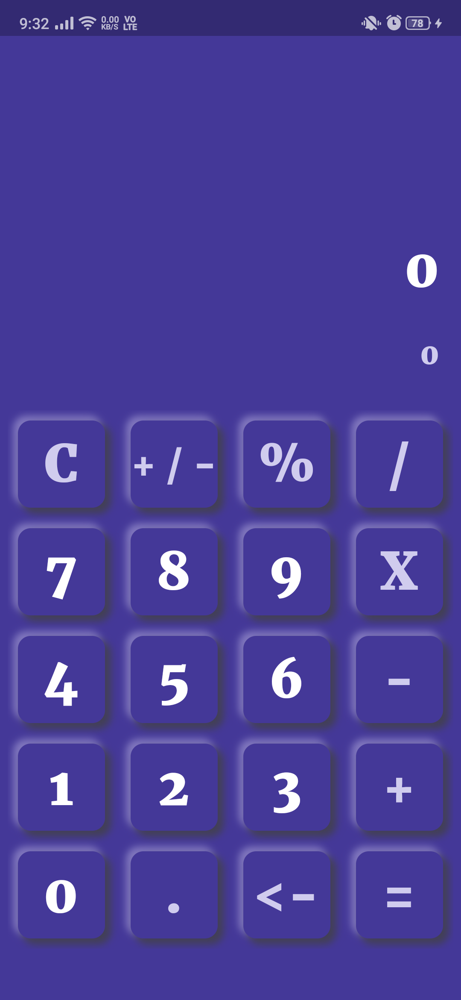
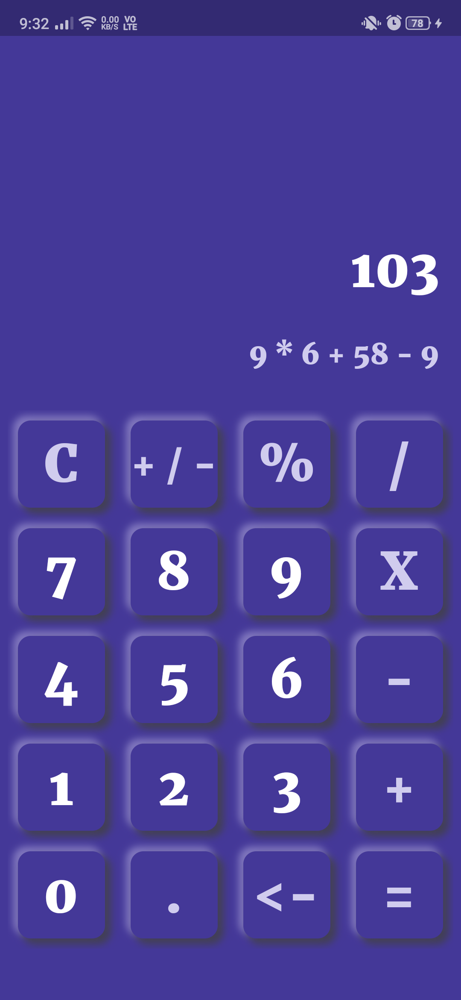

# Neumorphic Calculator App

### Introduction

A demo prototype calculator app with **Soft UI** build from scratch.

### Installation
To experience on the real device, install the ARM64 version APK [Neu Calci](outputs/NeuCalci.apk)

### Some Glimpse

  
   

>Made with love by **Utkarsh** :heart:

>*This app is built with sole intention of exploring and showcasing Flutter skills :relaxed:*